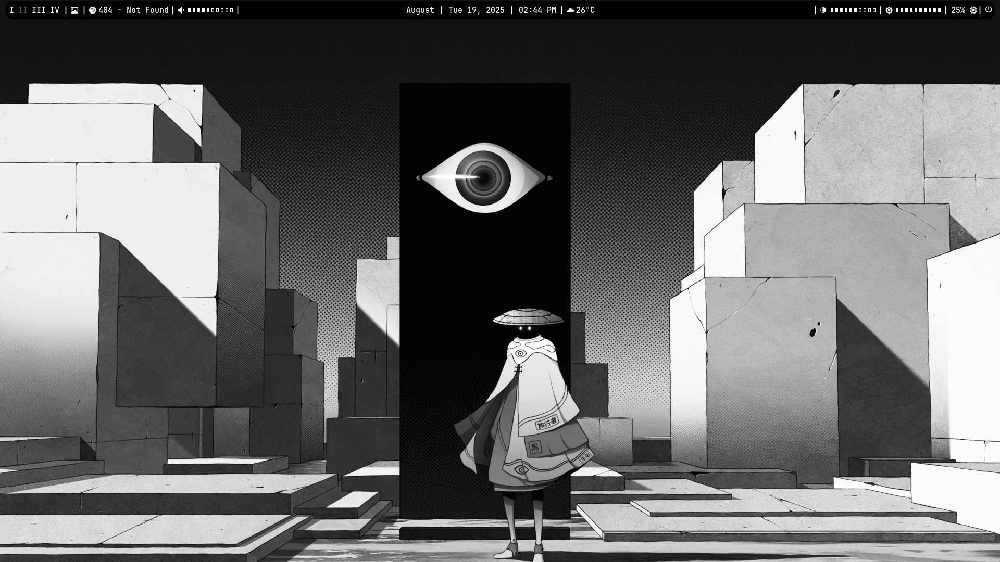
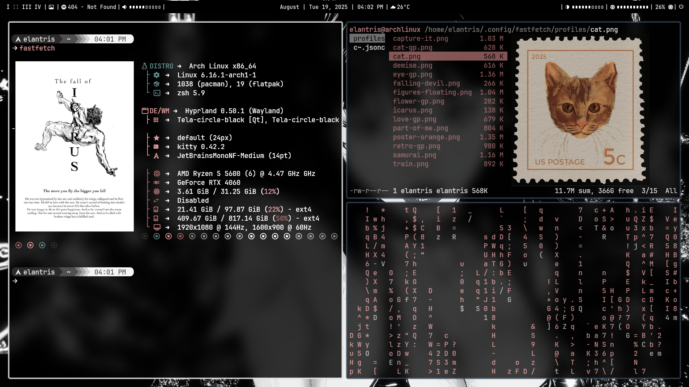
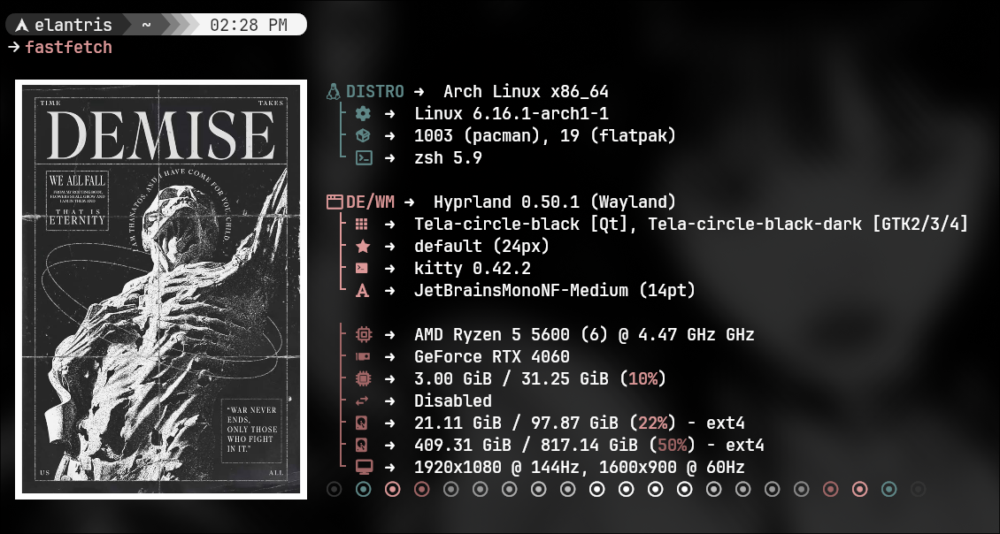
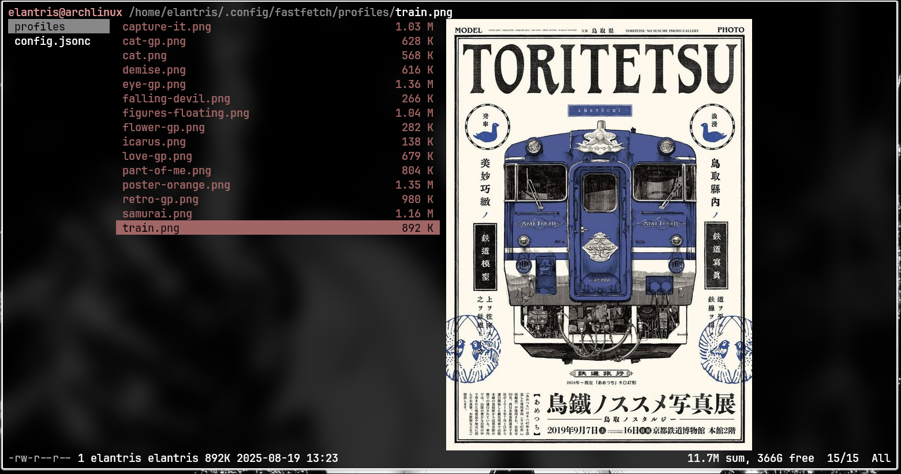

# Elantris's Dotfiles
Minimal and clean Arch Linux rice using Hyprland.

# Screenshots

## Desktop

## Terminal with Fastfech

## Ranger

## Dolphin (File Manager)

## Included Configs
- Hyprland
- Waybar
- Rofi
- Kitty
- Neovim
- Fastfech
- Ranger

## System Info

| Component  | Value                |
|------------|----------------------|
| OS         | Arch Linux           |
| WM         | Hyprland             |
| Terminal   | Kitty                |
| Shell      | Zsh with Oh-my-zsh   |
| Font       | JetBrains Mono NF    |
| Theme      | Breeze Dark          |
| Screenshot | Hyprshot             |
